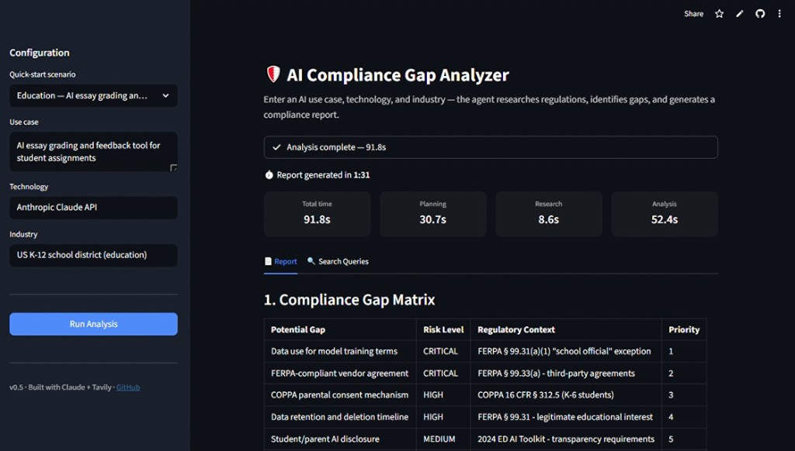

# AI Compliance Gap Analyzer

**Quickly see the potential compliance gaps between your AI technology and your industry's regulatory requirements.**

Built for early-stage AI startups who don't have the resources for expensive legal or compliance services. Describe your AI use case, your tech stack, and your industry — the agent researches relevant regulations, cross-references them against your technology's obligations, and delivers a clear, scannable gap report in about a minute.

> **[Try the Live Demo →](https://ai-compliance-gap-analyzer.streamlit.app/)**
>
> No sign-up. No API keys. Just pick a scenario or enter your own.



---

## What You Get

A structured compliance gap report covering:

- **Compliance Gap Matrix** — executive summary table with each potential gap, risk level, regulatory basis, and recommended action
- **Key Regulatory Landscape** — which frameworks and requirements apply to your case
- **Gap Details** — what each gap means and why it matters, framed as areas worth confirming (never assumptions about what you have or haven't done)
- **Recommended Next Steps** — grouped by priority so you know where to start
- **Bottom Line** — a concise takeaway you can act on immediately

Reports use a warm, supportive tone — like a knowledgeable friend pointing out things you might want to look into, not an auditor issuing violations.

> Showcase reports are included in the repo — see [`reports/`](reports/) for examples across healthcare, fintech, and RegTech.

---

## How It Works

```
You describe your AI system          The agent researches regulations
   (use case + tech + industry)         and cross-references gaps
           │                                      │
           ▼                                      ▼
   ┌───────────────┐    ┌───────────────┐    ┌───────────────┐
   │  You provide   │───▶│  Agent plans  │───▶│  Agent writes │
   │  3 inputs      │    │  & researches │    │  your report  │
   └───────────────┘    └───────────────┘    └───────────────┘
                                                    │
                                                    ▼
                                          Compliance gap report
                                          ready in ~1 minute
```

---

## Example

**Input:**
- Use case: "AI-powered resume screening tool"
- Technology: "OpenAI GPT-4 API"
- Industry: "Enterprise HR (US-based)"

**What the report covers:**
- Employment discrimination law (Title VII, ADA, state AI hiring laws)
- AI transparency and explainability requirements
- Data privacy obligations (CCPA, EEOC guidance)
- Vendor-specific compliance (OpenAI's usage policies for HR decisions)
- Bias testing and adverse impact analysis gaps

---

## What's Coming Next

- Consistent report structure enforcement (full template)
- PDF report generation
- Research adequacy loop (agent validates its own research before writing)
- Plugin version for AI agent platforms (OpenClaw and similar)

---

## Run It Locally

### Prerequisites

- Python 3.14+
- [Anthropic API key](https://console.anthropic.com/)
- [Tavily API key](https://tavily.com/)

### Setup

```bash
git clone https://github.com/yeyfreya/ai-compliance-gap-analyzer.git
cd ai-compliance-gap-analyzer

python -m venv venv
# Windows:
venv\Scripts\activate
# macOS/Linux:
source venv/bin/activate

pip install -r requirements.txt
```

Create a `.env` file in the project root:

```
ANTHROPIC_API_KEY = <your-anthropic-key>
TAVILY_API_KEY   = <your-tavily-key>
```

### Web UI

```bash
python -m streamlit run streamlit_app.py
```

Opens at `http://localhost:8501`. Pick a preset scenario or enter custom inputs, then click **Run Analysis**.

### CLI

```bash
python agent.py <scenario>
```

Available scenarios:

```bash
python agent.py hr          # AI resume screening — US employment law
python agent.py healthcare  # AI diagnostics — HIPAA, FDA
python agent.py fintech     # AI credit scoring — UK FCA, GDPR
python agent.py education   # AI essay grading — FERPA, COPPA
python agent.py regtech     # AI compliance analyzer — RegTech SaaS
```

---

## Built With

Claude Sonnet 4.5 (Anthropic) · Tavily · Langfuse · Supabase · Streamlit · Python

---

## Current Status

**v0.5.1** — Active development. See [ARCHITECTURE.md](docs/ARCHITECTURE.md) for technical decisions.

**Known limitations:**
- Analysis usually takes about a minute but can vary for complex or region-specific cases
- Minor formatting inconsistencies between reports (section styling may vary slightly)
- Linear pipeline (no research adequacy validation loop yet)

See [CHANGELOG.md](CHANGELOG.md) for version history and [docs/iterations/](docs/iterations/) for detailed analysis per version.

---

## Contributing

See the [project structure](docs/DOCUMENTATION-GUIDE.md) and [branching guide](docs/BRANCHING-GUIDE.md) for how the codebase and git workflow are organized.

---

## Author

**Freya Ye Yu** — [LinkedIn](https://www.linkedin.com/in/yeyufreya/) · [Portfolio](https://www.yeyufreya.com/)

MIT License
